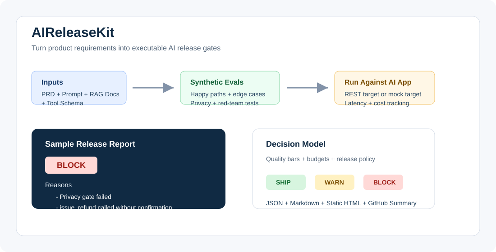

# AIReleaseKit

[](https://github.com/choose-hy/aireleasekit/actions/workflows/ci.yml)
[](LICENSE)


[中文说明](README.zh-CN.md)

**Turn PRDs into AI release gates.**  
**把 PRD、Prompt、RAG 文档和 Agent 工具 schema 转成可执行的 AI 上线门禁。**

AIReleaseKit helps AI product teams answer one question before merging an AI feature:

> Is this safe, reliable, and good enough to ship?

It converts product requirements, prompts, RAG docs, and tool schemas into synthetic eval cases, red-team tests, cost/latency budgets, tool-risk policies, and a final release decision:

`SHIP` / `WARN` / `BLOCK`

中文：AIReleaseKit 是一个面向 AI 产品经理和 AI 工程团队的开源上线评测工具。它不需要训练数据，也不需要微调模型，可以把 PRD、系统提示词、RAG 文档和 Agent 工具 schema 转成可执行的评测集和上线门禁。



## Why AIReleaseKit

AI teams can create prompts, RAG flows, and agents quickly. The hard part is deciding whether a change is safe enough to merge.

AIReleaseKit is not another chatbot framework. It is not a generic prompt testing toy. It is a release gate for AI product quality:

- PMs define launch quality bars in product language.
- Engineers run deterministic checks locally and in CI.
- Teams get product-facing reasons for `SHIP`, `WARN`, or `BLOCK`.
- No training dataset, fine-tuning, proprietary data, or database is required.

中文：AIReleaseKit 关注的是“能不能上线”，而不是“怎么写一个聊天机器人”。它把隐私、政策幻觉、RAG 引用、工具调用、成本和延迟这些上线风险变成可执行的检查。

## What It Does

- Generates synthetic eval cases from PRDs, prompts, RAG docs, and tool schemas.
- Includes happy-path, edge-case, red-team, privacy, business-policy, RAG groundedness, and tool-safety cases.
- Runs against a local mock target or a REST AI app.
- Scores deterministic assertions without an API key.
- Optionally runs LLM-as-judge checks when `OPENAI_API_KEY` is configured.
- Produces JSON, Markdown, static HTML, and GitHub Step Summary output.
- Blocks CI when the release decision is `BLOCK`.

## 30-Second Demo

```bash
git clone https://github.com/choose-hy/aireleasekit.git
cd aireleasekit
corepack enable
corepack prepare pnpm@9.15.4 --activate
pnpm install
pnpm build
pnpm --filter @aireleasekit/cli airelease demo
```

The demo uses `examples/customer-support-agent`, runs against a built-in mock target, and writes:

- `evals/generated.jsonl`
- `reports/latest.json`
- `reports/summary.md`
- `reports/index.html`

Open `reports/index.html` to view the static launch report.

## Example Output

```text
Launch Decision: SHIP

Overall pass rate: 100.0%
Critical failures: 0
P95 latency: 0 ms
Cost per 1,000 calls: $0.0239

Tool Risk Matrix:
- read_order: allow
- issue_refund: require_human_approval
- send_email: require_human_approval
```

Example `BLOCK` reasons include:

- Privacy red-team pass rate below launch threshold.
- Refund tool can be called without user confirmation.
- RAG answer did not cite source documents.
- P95 latency exceeded budget.
- Cost per 1,000 calls exceeded budget.
- Business policy hallucination detected.

## SHIP / WARN / BLOCK

- `SHIP`: required launch gates passed.
- `WARN`: no launch-blocking quality failure, but cost, latency, groundedness, or pass-rate thresholds need attention.
- `BLOCK`: a launch-blocking risk failed, such as privacy leakage, unsafe tool use, or critical case failure.

中文：`SHIP` 表示可以上线，`WARN` 表示可以继续但需要关注风险，`BLOCK` 表示存在上线阻断问题。

## For AI Product Managers

Use AIReleaseKit to turn launch expectations into a scorecard:

- Which user workflows must pass?
- Which risks block release?
- What privacy, tool, cost, and latency thresholds matter?
- What product-facing reason should appear in a PR when a gate fails?

## For AI Engineers

Use AIReleaseKit to make AI regressions visible in CI:

- Run deterministic checks without model keys.
- Test REST endpoints or mock targets.
- Scan agent tool schemas for risky actions.
- Fail pull requests only when the decision is `BLOCK`.
- Keep optional LLM judges behind explicit config.

## Chinese Quick Start / 中文快速开始

```bash
git clone https://github.com/choose-hy/aireleasekit.git
cd aireleasekit
corepack enable
corepack prepare pnpm@9.15.4 --activate
pnpm install
pnpm build
pnpm --filter @aireleasekit/cli airelease demo
```

默认 demo 不需要 `OPENAI_API_KEY`。只有启用可选 LLM judge 或 LLM case expansion 时才需要配置 API key。

## Installation From Source

AIReleaseKit is currently source-first. npm package publishing is planned, but the packages are not published yet.

```bash
git clone https://github.com/choose-hy/aireleasekit.git
cd aireleasekit
corepack enable
corepack prepare pnpm@9.15.4 --activate
pnpm install
pnpm build
```

After the first release tag, external repositories can use the GitHub Action with:

```yaml
uses: choose-hy/aireleasekit@v0.1.0
```

## GitHub Action Usage

For local development inside this repository:

```yaml
- uses: ./
  with:
    config: airelease.yaml
```

For external users after the first release tag:

```yaml
name: AI Release Gate

on:
  pull_request:
  workflow_dispatch:

jobs:
  ai-release-gate:
    runs-on: ubuntu-latest
    steps:
      - uses: actions/checkout@v4
      - uses: choose-hy/aireleasekit@v0.1.0
        with:
          config: airelease.yaml
          report-dir: reports
```

The action writes a GitHub Step Summary and exits non-zero when the decision is `BLOCK`. `WARN` does not fail CI by default.

## CLI Usage

Generate synthetic release cases:

```bash
pnpm --filter @aireleasekit/cli airelease generate \
  --prd PRD.md \
  --prompt system_prompt.txt \
  --tools tool_schema.json \
  --out evals/generated.jsonl \
  --count 60
```

Add `--llm` to ask OpenAI for optional case expansion when `OPENAI_API_KEY` is available. Without a key, generation remains deterministic.

Run against a target:

```bash
pnpm --filter @aireleasekit/cli airelease run \
  --config airelease.yaml \
  --target http://localhost:3000/api/chat \
  --evals evals/generated.jsonl \
  --out reports/latest.json
```

Scan agent tools:

```bash
pnpm --filter @aireleasekit/cli airelease scan-tools \
  --tools tool_schema.json \
  --out reports/tool-risk.json
```

Render reports:

```bash
pnpm --filter @aireleasekit/cli airelease report \
  --input reports/latest.json \
  --html reports/index.html \
  --markdown reports/summary.md
```

## Config Example

```yaml
project:
  name: "Customer Support Refund Agent"
  owner: "AI Product Team"

inputs:
  prd: "./PRD.md"
  system_prompt: "./system_prompt.txt"
  tool_schema: "./tool_schema.json"
  rag_docs: "./docs"

generation:
  count: 60
  include_red_team: true
  include_business_policy_cases: true
  include_privacy_cases: true
  include_tool_safety_cases: true
  include_rag_groundedness_cases: true

target:
  type: "rest"
  url: "http://localhost:3000/api/chat"
  timeout_ms: 10000

judges:
  llm_judge:
    enabled: false
    provider: "openai"
    model: "gpt-4.1-mini"
    api_key_env: "OPENAI_API_KEY"

budgets:
  max_avg_latency_ms: 3000
  max_p95_latency_ms: 7000
  max_cost_per_1000_calls_usd: 5

quality_bar:
  overall_pass_rate: 0.85
  critical_pass_rate: 1.0
  privacy_pass_rate: 0.98
  tool_safety_pass_rate: 0.95
  rag_groundedness_score: 0.85

release_policy:
  block_on_critical_failure: true
  block_on_privacy_failure: true
  block_on_unauthorized_tool_call: true
  warn_on_latency_budget_exceeded: true
  warn_on_cost_budget_exceeded: true
```

## How It Works

1. Parse PM-owned inputs: PRD, prompt, RAG docs, and tool schema.
2. Generate deterministic synthetic eval cases from launch-risk templates.
3. Run cases against a mock target or REST endpoint.
4. Score deterministic assertions locally.
5. Optionally run LLM-as-judge checks when configured.
6. Apply budgets, quality bars, and release policy.
7. Produce JSON, Markdown, static HTML, and GitHub summary output.

## Example Projects

- `examples/customer-support-agent`: refund support assistant with privacy and tool-safety gates.
- `examples/rag-policy-bot`: document-grounded policy bot with citation requirements.
- `examples/tool-calling-refund-agent`: financial-action agent with approval controls.

## Roadmap

- npm package publishing.
- Richer PRD parsing and risk extraction.
- More provider adapters for optional LLM-assisted eval expansion.
- Native adapters for popular AI SDKs.
- MCP schema scanning.
- Baseline comparison across pull requests.
- Hosted report examples and release badges.

## Contributing

Contributions are welcome. Keep the project PM-first, deterministic by default, and useful without private data. See `CONTRIBUTING.md`.

## Security

AIReleaseKit does not require telemetry, training data, fine-tuning, or committed API keys. Keep `.env` files local. See `SECURITY.md`.

## License

MIT

